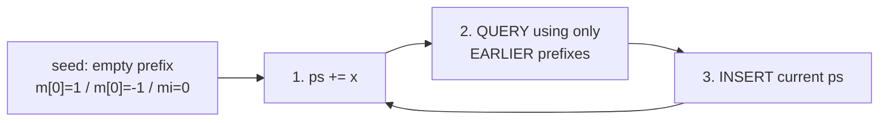
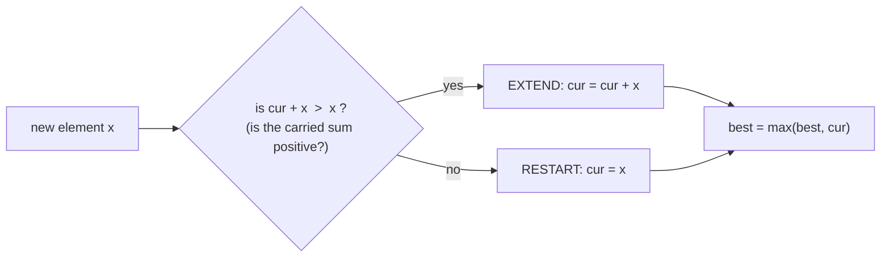
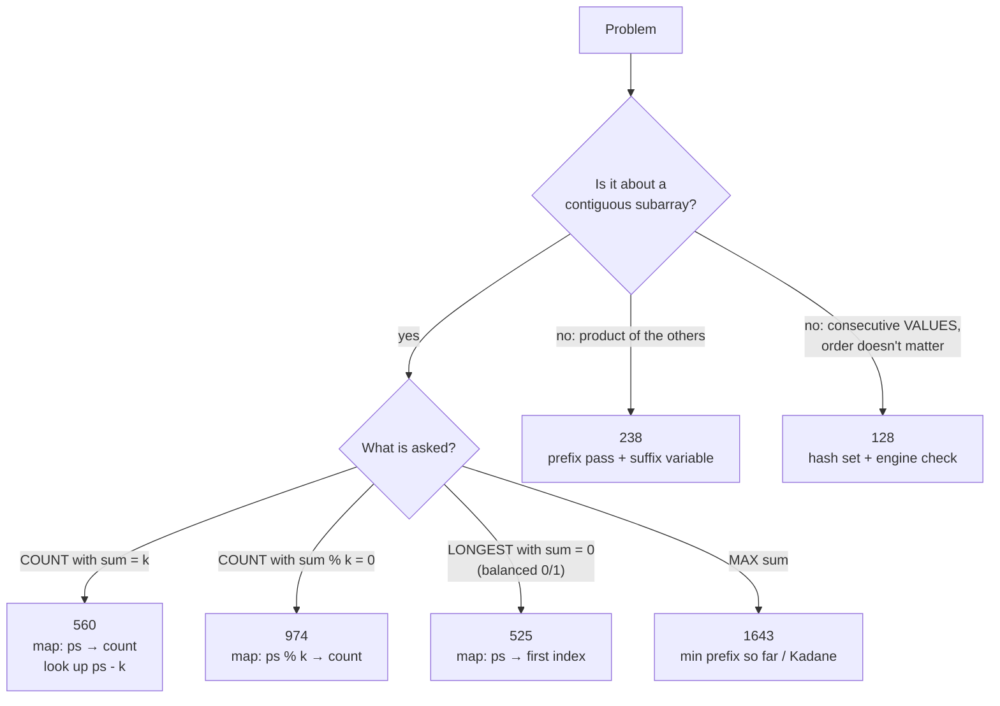

# DAY 1: Prefix Sums, Hashing & Running Values

> Notes for every problem solved on Day 1, with the intuition, dry runs, graphs and the bugs I actually made.
> The flowcharts use Mermaid. They render on GitHub; in VS Code you need the *Markdown Preview Mermaid Support* extension.

| # | Problem | Core trick | Time | Extra space |
|---|---|---|---|---|
| 1 | [LC 560 Subarray Sum Equals K](#1-lc-560--subarray-sum-equals-k) | map: prefix sum → **count** | O(n) | O(n) |
| 2 | [LC 525 Contiguous Array](#2-lc-525--contiguous-array) | 0 → -1, map: prefix sum → **first index** | O(n) | O(n) |
| 3 | [LC 974 Subarray Sums Divisible by K](#3-lc-974--subarray-sums-divisible-by-k) | map: **remainder** → count | O(n) | O(k) |
| 4 | [LC 128 Longest Consecutive Sequence](#4-lc-128--longest-consecutive-sequence) | hash set + **engine check** | O(n) | O(n) |
| 5 | [LC 238 Product of Array Except Self](#5-lc-238--product-of-array-except-self) | prefix pass + **suffix variable** | O(n) | O(1) |
| 6 | [CSES 1643 Maximum Subarray Sum](#6-cses-1643--maximum-subarray-sum) | **min prefix so far** / Kadane | O(n) | O(1) |
| 7 | [CSES 1661 Subarray Sums II](#7-cses-1661--subarray-sums-ii) | 560 + `long long` + anti-hash care | O(n) | O(n) |

---

## 0. The foundation: prefix sums

`ps[j]` = the sum of everything from index 0 up to index `j`.

```
index:          0    1    2    3
nums:        [  1,   2,   3,   4 ]
ps:       0     1    3    6   10
          ↑
          empty prefix (before index 0)
```

**Any subarray sum is the difference of two prefix sums:**

```
sum(i+1 … j) = ps[j] - ps[i]

e.g. sum(1…2) = 2 + 3 = 5 = ps[2] - ps[0] = 6 - 1 ✓
```

So a question about a **subarray** becomes a question about a **pair of prefix sums**. And for "find a matching earlier prefix" questions, a hashmap gives O(1) lookups.

### The golden loop (used in 560, 525, 974, 1643)



```
1. update ps
2. query the map / running value   ← it must only contain EARLIER positions
3. insert the current ps
```

**Why query before insert?** If you insert first, the current position pairs with **itself**, which is the empty subarray `(j+1 … j)`. Its sum is 0, so it looks like "sum 0" / "divisible by k" and gets counted by mistake.

**Why seed the empty prefix?** Without it, subarrays that start at index 0 have no left partner and never get counted.

---

## 1. LC 560: Subarray Sum Equals K

**Count** the subarrays whose sum is exactly `k`.

### Intuition

```
ps[j] - ps[i] = k   ⇔   ps[i] = ps[j] - k
```

When you stand at `j`, ask: **"how many earlier prefix sums equal `ps - k`?"** Each one is the left end of a valid subarray. So the map stores **prefix sum → how many times it has appeared**.

### Graph: `nums = [1, 2, 3]`, `k = 3`

The dots are the prefix sums. Every pair of dots that are **exactly 3 apart vertically** is a valid subarray.

```
 ps
  6 |              ●      ← 6 - 3 = 3 ✓ seen  → subarray [3]
  5 |
  4 |
  3 |          ●          ← 3 - 3 = 0 ✓ seen  → subarray [1,2]
  2 |
  1 |      ●              ← 1 - 3 = -2 ✗
  0 |  ●   (empty prefix seed)
    +----------------
      st  0   1   2       index
```

Answer: **2**

### Dry run

| x | ps | look for ps-k | found? | count | map after insert |
|---|---|---|---|---|---|
| start | 0 | | | 0 | `{0:1}` |
| 1 | 1 | -2 | ✗ | 0 | `{0:1, 1:1}` |
| 2 | 3 | 0 | ✓ ×1 | 1 | `{0:1, 1:1, 3:1}` |
| 3 | 6 | 3 | ✓ ×1 | **2** | `{…, 6:1}` |

### Dry run: test case in my file `v = {2,-1,3,5,-2}`, `k = 7`

At each step, look for an earlier prefix sum that is **exactly 7 below** the current one.

```
 ps
  9 |                  b        ← 9 - 7 = 2 → matches B   → subarray [-1,3,5]
  8 |                  ┆
  7 |                  ┆   a    ← 7 - 7 = 0 → matches A   → subarray [2,-1,3,5,-2]
  6 |                  ┆   ┆
  5 |                  ┆   ┆
  4 |              ●   ┆   ┆
  3 |                  ┆   ┆
  2 |      B┄┄┄┄┄┄┄┄┄┄┄┘   ┆      gap = 7
  1 |          ●           ┆
  0 |  A┄┄┄┄┄┄┄┄┄┄┄┄┄┄┄┄┄┄┄┘      gap = 7
    +------------------------
      st  0   1   2   3   4       index
```

| idx | x | ps | look for ps-7 | m before | found | c | m after `m[ps]++` |
|---|---|---|---|---|---|---|---|
| start | | 0 | | | | 0 | `{0:1}` |
| 0 | 2 | 2 | -5 | `{0:1}` | ✗ | 0 | `{0:1, 2:1}` |
| 1 | -1 | 1 | -6 | `{0:1, 2:1}` | ✗ | 0 | `{0:1, 2:1, 1:1}` |
| 2 | 3 | 4 | -3 | `{0:1, 2:1, 1:1}` | ✗ | 0 | `{…, 4:1}` |
| 3 | 5 | 9 | **2** | `{0:1, 2:1, 1:1, 4:1}` | ✓ ×1 | 1 | `{…, 9:1}` |
| 4 | -2 | 7 | **0** | `{0:1, 2:1, 1:1, 4:1, 9:1}` | ✓ ×1 | **2** | `{…, 7:1}` |

Output: **2**

| found at idx | matched earlier ps | at | subarray | check |
|---|---|---|---|---|
| 3 | 2 | idx 0 | `[-1, 3, 5]` (idx 1…3) | -1+3+5 = 7 ✓ |
| 4 | 0 | start (seed) | `[2, -1, 3, 5, -2]` (idx 0…4) | 2-1+3+5-2 = 7 ✓ |

> The second answer **only exists because of the seed `m[0]=1`**. Without it, the subarray starting at index 0 is missed and the output would be 1.
>
> Note the negative numbers: the prefix sum goes **down** at idx 1 and idx 4. That's why a sliding window can't solve this problem, but prefix sums can.

### Extra dry run: `v = {1,-1,1,-1}`, `k = 0`

With `k = 0` you look up `ps - 0 = ps` itself, so you're asking **"how many times have I been at this exact prefix sum before?"**

```
 ps
  1 |      ●       ●          ← ps = 1 at idx 0 and 2
  0 |  ●       ●       ●      ← ps = 0 at st, idx 1 and 3
    +--------------------
      st  0   1   2   3       index
```

Every pair of dots at the **same height** is a subarray with sum 0.

| idx | x | ps | look for ps-k | m before | found | c | m after `m[ps]++` |
|---|---|---|---|---|---|---|---|
| start | | 0 | | | | 0 | `{0:1}` |
| 0 | 1 | 1 | 1 | `{0:1}` | ✗ | 0 | `{0:1, 1:1}` |
| 1 | -1 | 0 | 0 | `{0:1, 1:1}` | ✓ ×1 | 1 | `{0:2, 1:1}` |
| 2 | 1 | 1 | 1 | `{0:2, 1:1}` | ✓ ×1 | 2 | `{0:2, 1:2}` |
| 3 | -1 | 0 | 0 | `{0:2, 1:2}` | ✓ ×2 | **4** | `{0:3, 1:2}` |

Output: **4**. Which subarrays they are:

| found at idx | paired with an earlier ps at | subarray | sum |
|---|---|---|---|
| 1 | start (ps 0) | `[1,-1]` (idx 0…1) | 0 |
| 2 | idx 0 (ps 1) | `[-1,1]` (idx 1…2) | 0 |
| 3 | start (ps 0) | `[1,-1,1,-1]` (idx 0…3) | 0 |
| 3 | idx 1 (ps 0) | `[1,-1]` (idx 2…3) | 0 |

> This test case is the best check of **query before insert**. With `k = 0` the key you search for equals the key you insert, so inserting first would match every element with itself and print 8 instead of 4.

### Code

```cpp
int solve(vector<int>& v, int k){
    unordered_map<int,int> m;
    m[0] = 1;                    // empty prefix
    int c = 0, ps = 0;
    for(auto it : v){
        ps += it;
        c += m[ps - k];          // query earlier prefixes
        m[ps]++;                 // then insert current
    }
    return c;
}
```

### 🐞 Bug I made

```cpp
m[n]++;     // ❌ inserted ps-k (the thing I was SEARCHING for)
m[ps]++;    // ✅ insert the prefix sum I'm AT
```

On `[1,2,3], k=3` the buggy version returned **1** instead of 2: prefix sum 3 never got stored, so the subarray `[3]` was missed.

> Why a sliding window doesn't work here: the numbers can be **negative**, so making the window bigger doesn't always make the sum bigger.

---

## 2. LC 525: Contiguous Array

Find the **longest** subarray with an equal number of 0s and 1s.

### Intuition

1. Count each **1 as +1** and each **0 as -1**.
2. Equal 0s and 1s ⇔ the +1s and -1s cancel ⇔ **sum = 0**.
3. Sum 0 ⇔ `ps[i] == ps[j]`, meaning **the same height twice**.
4. For the **longest** stretch, pair today with the **earliest** time you were at this height. So store the **first index** and never overwrite it.

### Graph: `[0,1,1,0,1,1,1,0]`, a mountain walk

```
 ps
  3 |                              ●
  2 |                          ●       ●
  1 |              ●       ●
  0 |  ◆━━━━━━━◆━━━━━━━◆                    ← height 0 at st, 1 and 3
 -1 |      ●
    +------------------------------------
      st  0   1   2   3   4   5   6   7     index
          └─────────────┘
          [0, 1, 1, 0]   farthest pair st…3 → length = 3 - (-1) = 4
```

Every time the walk **comes back to a height it has been at before**, the stretch in between is balanced. The longest such stretch is the answer.

### Dry run

| idx | val | ±1 | ps | first seen? | length | ans |
|---|---|---|---|---|---|---|
| -1 | | | 0 | store `0 → -1` | | 0 |
| 0 | 0 | -1 | -1 | store `-1 → 0` | | 0 |
| 1 | 1 | +1 | 0 | seen at -1 | 2 | 2 |
| 2 | 1 | +1 | 1 | store `1 → 2` | | 2 |
| 3 | 0 | -1 | 0 | seen at -1 | **4** | **4** |
| 4 | 1 | +1 | 1 | seen at 2 | 2 | 4 |
| 5 | 1 | +1 | 2 | store `2 → 5` | | 4 |
| 6 | 1 | +1 | 3 | store `3 → 6` | | 4 |
| 7 | 0 | -1 | 2 | seen at 5 | 2 | 4 |

### 560 vs 525

| | 560 (how many?) | 525 (how long?) |
|---|---|---|
| map stores | prefix sum → **count** | prefix sum → **first index** |
| seed | `m[0] = 1` (seen once) | `m[0] = -1` (index before 0) |
| on a match | `c += m[ps-k]` | `ans = max(ans, i - m[ps])` |
| insert | always `m[ps]++` | **only if not present** |

### Code

```cpp
int solve(vector<int> v){
    unordered_map<int,int> m;
    m[0] = -1;
    int ans = 0, ps = 0;
    for(int i = 0; i < v.size(); i++){
        ps += v[i] == 1 ? 1 : -1;
        if(m.find(ps) != m.end()) ans = max(i - m[ps], ans);
        else                      m[ps] = i;     // first time only
    }
    return ans;
}
```

### 🐞 Bugs I made

| Bug | Why it's wrong | Example |
|---|---|---|
| `ps += 1 ? v[i]==1 : -1;` | the condition is `1` (always true), so 0s added **0**, not -1 | `{0,1,1,1,1,1,0,0,0}` gave 3 instead of 6 |
| `ans = i - m[ps];` | keeps the **latest** length, not the **longest** | `{0,1,1,0,1,1,1,0}` gave 2 instead of 4 |

> Ternary syntax: `condition ? valueIfTrue : valueIfFalse`, so the condition comes **first**.

---

## 3. LC 974: Subarray Sums Divisible by K

**Count** the subarrays whose sum is divisible by `k`.

### Intuition: a clock with k hours

Walk around a clock with `k` positions. Your position is `ps % k`.

```
          k = 5
            0
        4       1
         3     2
```

A subarray divisible by `k` means you walked **some number of full laps**, so you're back **at the same position**.

```
sum(i+1…j) = ps[j] - ps[i] ≡ 0 (mod k)   ⇔   ps[i] % k == ps[j] % k
```

So it's **560 with remainders as the keys**: count the earlier prefixes that had the **same remainder**.

### Graph: `[4,5,0,-2,-3,1]`, k = 5, clock position over time

```
 rem
  4 |      ●   ●   ●       ●           ← position 4 visited 4 times
  3 |
  2 |                  ●
  1 |
  0 |  ●                       ●       ← position 0 visited 2 times (incl. start)
    +----------------------------
      st  0   1   2   3   4   5        index
```

**Shortcut view:** each pair of visits to the same position is one valid subarray.

```
rem 0 : {st, 5}            → C(2,2) = 1
rem 4 : {0, 1, 2, 4}       → C(4,2) = 6
rem 2 : {3}                → C(1,2) = 0
                             total  = 7 ✓
```

### Dry run (query first, then insert)

| x | ps | rem | seen before | count |
|---|---|---|---|---|
| start | 0 | 0 | | `{0:1}` |
| 4 | 4 | 4 | 0 | 0 |
| 5 | 9 | 4 | 1 | 1 |
| 0 | 9 | 4 | 2 | 3 |
| -2 | 7 | 2 | 0 | 3 |
| -3 | 4 | 4 | 3 | 6 |
| 1 | 5 | 0 | 1 | **7** |

### ⚠️ Trap: negative remainders in C++

In C++ `-2 % 5 == -2`, but on the clock -2 and 3 are the **same position**.

```
nums = [3, -5], k = 5
ps        :  3   -2
raw  %    :  3   -2   ✗ keys don't match → answer 0
fixed     :  3    3   ✓ match            → answer 1  (subarray [-5])

fix:  rem = ((ps % k) + k) % k;
```

### ⚠️ Trap: query and insert order

At `x = 0` (ps = 9, rem = 4, and `m[4] = 2` already):

```
✅ c += m[4] → 3,  then m[4]++ → 3      (2 new: [5,0] and [0])
❌ m[4]++ → 3,  then c += m[4] → 4      (+1 fake: the element paired with itself)
```

The wrong order adds **+1 for every element**: 7 + 6 = 13 ❌.

### Code

```cpp
int solve(vector<int>& v, int k){
    vector<int> m(k, 0);          // remainders are 0…k-1, so an array works
    m[0] = 1;
    int ps = 0, c = 0;
    for(auto it : v){
        ps += it;
        int p = ((ps % k) + k) % k;
        c += m[p];
        m[p]++;
    }
    return c;
}
```

---

## 4. LC 128: Longest Consecutive Sequence

Find the length of the longest run of consecutive **values** in O(n). Order in the array doesn't matter.

### Intuition: trains and engines

Put the numbers on a number line. Each consecutive run is a **train**.

```
nums = [100, 4, 200, 1, 3, 2]

 0   1   2   3   4   5  ...  99  100  101 ... 199  200  201
     🚂━━🚃━━🚃━━🚃                🚂                🚂
     └── length 4 ──┘             len 1             len 1
```

Every train has exactly one **engine** 🚂, the number with **nothing directly before it**:

> **x is an engine ⇔ (x - 1) is NOT in the set**

**Only start counting at an engine**, then walk forward `x+1, x+2, …` while those numbers exist.

### Why this is O(n), not O(n²)

```
Without the engine check, on [1,2,3,4,5]:
from 1: 1→2→3→4→5      5 steps
from 2:   2→3→4→5      4 steps
from 3:     3→4→5      3 steps      → 5+4+3+2+1 = O(n²) ❌
...

With the engine check:
from 1: 1→2→3→4→5      5 steps
2,3,4,5: "x-1 exists" → skip instantly            → O(n) ✅
```

Each number is touched **at most twice**: once by the outer loop, and once while being walked over from its engine.

### Dry run

| x | x-1 in set? | engine? | walk | length |
|---|---|---|---|---|
| 100 | 99 ✗ | ✅ | 101 ✗ | 1 |
| 4 | 3 ✓ | skip | | |
| 200 | 199 ✗ | ✅ | 201 ✗ | 1 |
| 1 | 0 ✗ | ✅ | 2 ✓ 3 ✓ 4 ✓ 5 ✗ | **4** |
| 3 | 2 ✓ | skip | | |
| 2 | 1 ✓ | skip | | |

### Dry run: test case in my file `v = {0,3,7,2,5,8,4,6,0,1}`

**Step 1: build the set.** The duplicate `0` disappears:

```
v   = {0, 3, 7, 2, 5, 8, 4, 6, 0, 1}      (10 numbers)
set = {0, 1, 2, 3, 4, 5, 6, 7, 8}         (9 unique values)
```

**Step 2: place them on the number line.** It's one long train:

```
value :  -1    0   1   2   3   4   5   6   7   8    9
          ✗    E───c───c───c───c───c───c───c───c    ✗
               ↑                                    ↑
        -1 missing → 0 is the ENGINE         9 missing → stop
```

**Step 3: loop over the set** (`unordered_set` order is random; it's shown sorted here, and the result is the same in any order):

| x | x-1 in set? | engine? | walk | c | ans |
|---|---|---|---|---|---|
| 0 | -1 ✗ | ✅ | 1✓ 2✓ 3✓ 4✓ 5✓ 6✓ 7✓ 8✓ 9✗ | 9 | **9** |
| 1 | 0 ✓ | skip | | | 9 |
| 2 | 1 ✓ | skip | | | 9 |
| 3 | 2 ✓ | skip | | | 9 |
| 4 | 3 ✓ | skip | | | 9 |
| 5 | 4 ✓ | skip | | | 9 |
| 6 | 5 ✓ | skip | | | 9 |
| 7 | 6 ✓ | skip | | | 9 |
| 8 | 7 ✓ | skip | | | 9 |

Output: **9**.

Work done: 9 outer checks + 8 forward steps from the single engine ≈ **2n**, not n².

> If you looped over `v` instead of the set, the engine `0` appears **twice** in `v`, so the whole 9-long train would be walked twice.

### Code

```cpp
int solve(vector<int>& v){
    int ans = 0;
    unordered_set<int> s(v.begin(), v.end());
    for(auto it : s){                   // loop over the SET (handles duplicates)
        if(s.find(it - 1) == s.end()){  // engine
            int c = 1;
            while(s.count(it + c)) c++;
            ans = max(c, ans);
        }
    }
    return ans;
}
```

### 🐞 Bugs I made

| Bug | Effect |
|---|---|
| checked `it+1` instead of `i+1` | `it` never changes → **infinite loop** |
| `c = 0` | engine not counted → off by one (gave 3, not 4) |
| `ans = 1` | empty array returned 1 instead of 0 |
| `set<int>` | tree, O(log n) per operation → O(n log n). Use `unordered_set` for O(n) |

> Loop over the **set**, not the array. With `[1,1,1,1,2,3]` the engine `1` would otherwise walk its train 4 times.

---

## 5. LC 238: Product of Array Except Self

`ans[i]` = the product of everything except `nums[i]`, without division, in O(1) extra space (the output array doesn't count).

### Intuition

```
ans[i] = (product of everything LEFT of i) × (product of everything RIGHT of i)

i = 2:   [ 1   2 ]  [3]  [ 4 ]
          left = 2  skip  right = 4     →  ans[2] = 8
```

The two-array version builds `prefix[]` and `suffix[]`. But look at how `suffix[]` is used: it's built right to left, and each value is used **exactly once, right after it's made**.

> If you consume a value as soon as you produce it, you don't need to store the array. **One running variable is enough.**

So:
- **Pass 1 (→):** write the left products **directly into `ans`**
- **Pass 2 (←):** keep a single `suf` and multiply it into `ans[i]`

### Diagram

```
nums      :   1     2     3     4

Pass 1 →  pre:  1 ──×1──▶ 1 ──×2──▶ 2 ──×3──▶ 6
ans       :   1     1     2     6        (left products)

Pass 2 ←  suf:  24 ◀──×2── 12 ◀──×3── 4 ◀──×4── 1
ans ×= suf:  1×24  1×12  2×4   6×1
ans       :   24    12    8     6     ✅
```

### Dry run

**Pass 1 (left → right), pre = 1**

| i | ans[i] = pre | pre *= nums[i] |
|---|---|---|
| 0 | 1 | 1 |
| 1 | 1 | 2 |
| 2 | 2 | 6 |
| 3 | 6 | 24 |

**Pass 2 (right → left), suf = 1**

| i | ans[i] *= suf | suf *= nums[i] |
|---|---|---|
| 3 | 6×1 = **6** | 4 |
| 2 | 2×4 = **8** | 12 |
| 1 | 1×12 = **12** | 24 |
| 0 | 1×24 = **24** | 24 |

### Rules

- **Use first, then multiply in `nums[i]`**, otherwise `nums[i]` ends up in its own product (the same idea as query-before-insert).
- **Start at 1**, because the product of nothing is 1 (for sums, the starting value is 0).
- **Zeros need no special handling.** With `[-1,1,0,-3,3]`, every product that crosses the 0 becomes 0, and only the 0's own position gets a non-zero answer: `[0,0,9,0,0]`.

### Code

```cpp
vector<int> solve(vector<int>& v){
    int n = v.size();
    vector<int> ans(n);
    int pre = 1;
    for(int i = 0; i < n; i++){ ans[i] = pre; pre *= v[i]; }
    int suf = 1;
    for(int i = n-1; i >= 0; i--){ ans[i] *= suf; suf *= v[i]; }
    return ans;
}
```

| | two arrays | optimized |
|---|---|---|
| left products | `prefix[]` | stored in `ans[]` |
| right products | `suffix[]` | one variable `suf` |
| extra space | O(n) | **O(1)** |

---

## 6. CSES 1643: Maximum Subarray Sum

Find the largest sum of a **non-empty** subarray. n ≤ 2·10⁵, |x| ≤ 10⁹.

Sample: `[-1, 3, -2, 5, 3, -5, 2, 2]` gives **9** (`3, -2, 5, 3`).

### View 1: prefix sums ("buy low, sell high")

```
sum(i+1…j) = ps[j] - ps[i]
```

To make that as **big** as possible at `j`, subtract the **smallest prefix sum seen before `j`**.

```
 ps
  8 |                      ▲            ← highest point AFTER the valley
  7 |                                  ●
  6 |
  5 |                  ●           ●
  4 |
  3 |                          ●
  2 |          ●
  1 |
  0 |  ●           ●
 -1 |      ▼                            ← lowest valley BEFORE the peak
    +------------------------------------
      st  0   1   2   3   4   5   6   7   index

answer = 8 - (-1) = 9      subarray = indices 1…4 = [3, -2, 5, 3]
```

> The valley has to come **before** the peak. That's why `max(ps) - min(ps)` over the whole array is **wrong**.

### View 2: Kadane ("drop dead weight")

`cur` = the best sum of a subarray that **ends at the current element**. At every `x` you choose:



> If the sum you're carrying is negative, it can only drag `x` down, so leave it behind and start fresh.

| x | extend | restart | cur | best |
|---|---|---|---|---|
| -1 | — | -1 | -1 | -1 |
| 3 | 2 | **3** | 3 | 3 |
| -2 | **1** | -2 | 1 | 3 |
| 5 | **6** | 5 | 6 | 6 |
| 3 | **9** | 3 | 9 | **9** |
| -5 | **4** | -5 | 4 | 9 |
| 2 | **6** | 2 | 6 | 9 |
| 2 | **8** | 2 | 8 | 9 |

The two views are the same algorithm: Kadane **restarts** at exactly the moment the prefix view finds a **new minimum**.

### Code (both)

```cpp
#define ll long long
ll solve(vector<ll>& v){            // prefix-sum view
    ll ps = 0, mi = 0, ans = LLONG_MIN;
    for(auto it : v){
        ps += it;
        ans = max(ps - mi, ans);    // query earlier minimum first
        mi  = min(ps, mi);          // then insert current ps
    }
    return ans;
}

ll solve2(vector<ll>& v){           // Kadane
    ll curr = 0, ans = LLONG_MIN;
    for(auto it : v){
        curr = max(it, it + curr);  // extend or restart
        ans  = max(curr, ans);
    }
    return ans;
}
```

### 🐞 Bugs I made

| Bug | Example that breaks it |
|---|---|
| `return mx - mi` (global max − global min) | `[5,-10]` gave 10 (min came **after** max); the answer is 5 |
| `mi` didn't include the empty prefix 0 | `[3,2]` gave 2; the answer is 5 |
| all negatives | `[-3,-1,-2]` gave 3; the answer is -1 |
| `vector<ll> v(n)` + `push_back` | `n` extra zeros in front of the real data |
| `while(n>=0)` without `n--` | infinite loop |
| `while(n>=0)` with `n--` | reads **n+1** numbers → fake 0 appended |
| `return 0;` | always printed 0 |

### ⚠️ CSES traps

- Use **`long long`**: the sum can reach 2·10⁵ × 10⁹ = 2·10¹⁴.
- **Non-empty**, so all-negative input returns the largest element. Never start with `best = 0`.

---

## 7. CSES 1661: Subarray Sums II

**Count** the subarrays whose sum is exactly `x`. n ≤ 2·10⁵, |aᵢ|, |x| ≤ 10⁹, and values can be negative.

### Intuition

It's **exactly LC 560**, with CSES-sized numbers. Same golden loop: seed `m[0]=1`, look up `ps - x`, then insert `ps`.

```
ps[j] - ps[i] = x   ⇔   look for (ps - x) among earlier prefix sums
```

The CSES sample `5 7 / 2 -1 3 5 -2` is the **same test case as my 560 file**, so the full dry run and graph are in [section 1](#dry-run-test-case-in-my-file-v--2-13-5-2-k--7). Output: **2** (`[-1,3,5]` and the whole array).

### Why `long long` everywhere

| variable | worst case | fits in `int` (≈ 2.1·10⁹)? |
|---|---|---|
| `ps` | 2·10⁵ × 10⁹ = **2·10¹⁴** | ❌ |
| `c` (the answer) | all zeros with x = 0 → every subarray counts → n(n+1)/2 ≈ **2·10¹⁰** | ❌ |
| each element `t` | 10⁹ | ✅ `int` is fine here |

```
n = 200000 zeros, x = 0
every one of the n(n+1)/2 subarrays sums to 0
answer = 200000 × 200001 / 2 = 20,000,100,000   ← overflows int
```

### ⚠️ CSES trap: anti-hash tests (TLE)

`unordered_map` is a hash table: the hash of a key picks a **bucket**. Normally keys spread out, so each lookup is O(1).

CSES has tests with numbers chosen so that **all keys land in the same bucket**:

```
normal input                          anti-hash input
bucket 0: [ 5 ]                       bucket 0: [ k1 → k2 → k3 → … → k200000 ]
bucket 1: [ -3 ]                      bucket 1: [ ]
bucket 2: [ 12 → 7 ]                  bucket 2: [ ]
bucket 3: [ 0 ]                       bucket 3: [ ]
lookup ≈ O(1) → total O(n)            lookup = O(n) → total O(n²) → TLE ❌
```

So a **logically correct** solution can still show **TIME LIMIT EXCEEDED**. Two fixes:

**Fix 1 (easiest): `map<ll,ll>`.** It's a balanced tree, O(log n) per operation **guaranteed**, so it can't be attacked. O(n log n) easily passes for n = 2·10⁵.

```cpp
map<ll,ll> m;     // just change the type
```

**Fix 2 (keep O(n)): a randomized hash.** The attacker can't predict the buckets if the hash uses a random seed chosen at runtime.

```cpp
struct custom_hash {
    static uint64_t splitmix64(uint64_t x) {
        x += 0x9e3779b97f4a7c15;
        x = (x ^ (x >> 30)) * 0xbf58476d1ce4e5b9;
        x = (x ^ (x >> 27)) * 0x94d049bb133111eb;
        return x ^ (x >> 31);
    }
    size_t operator()(uint64_t x) const {
        static const uint64_t FIXED_RANDOM =
            chrono::steady_clock::now().time_since_epoch().count();
        return splitmix64(x + FIXED_RANDOM);
    }
};
unordered_map<ll,ll,custom_hash> m;
```

| | `unordered_map` | `map` | `unordered_map` + custom hash |
|---|---|---|---|
| per operation | O(1) avg, **O(n) attacked** | O(log n) always | O(1) avg, safe |
| on CSES 1661 | may TLE ❌ | passes ✅ | passes ✅ |

> LeetCode doesn't do this, so plain `unordered_map` is fine there. On **CSES / Codeforces**, be careful with `unordered_map` and `unordered_set`.

### ⚡ Fast input: `ios::sync_with_stdio(false); cin.tie(nullptr);`

Reading 2·10⁵ numbers with the default `cin` is slow. Two reasons, one switch each:

| line | what it turns off | why it was slow |
|---|---|---|
| `ios::sync_with_stdio(false)` | keeping `cin/cout` in sync with C's `scanf/printf` | every read goes through C stdio, with no buffering of its own |
| `cin.tie(nullptr)` | flushing `cout` before every `cin` read | a flush is a system call, done before each of the 2·10⁵ reads |

```
default:      cin ──sync──▶ C stdio ──▶ input        (+ flush cout before every read)
after switch: cin ──own buffer──▶ input              (no flushes)
```

> After this line, **don't mix** `scanf/printf` with `cin/cout` in the same program, because their outputs can come out in the wrong order.
>
> Put it as the **first line of `main()`** in every CSES / Codeforces solution.

### Code

```cpp
#define ll long long
ll solve(vector<ll>& v, ll k){
    map<ll,ll> m;                    // map, not unordered_map: safe from anti-hash tests
    m[0] = 1;
    ll c = 0, ps = 0;
    for(auto it : v){
        ps += it;
        ll n = ps - k;
        if(m.find(n) != m.end()) c += m[n];
        m[ps]++;
    }
    return c;
}

int main(){
    ios::sync_with_stdio(false); cin.tie(nullptr);
    ll n, x;
    cin >> n >> x;
    vector<ll> v;
    while(n > 0){
        int t;
        cin >> t;
        v.push_back(t);
        n--;
    }
    cout << solve(v, x);
}
```

### Tests I ran

| test | expected | output |
|---|---|---|
| `5 7` / `2 -1 3 5 -2` (CSES sample) | 2 | 2 ✅ |
| `3 0` / `-1 1 0` | 3 | 3 ✅ |
| 200000 zeros, x = 0 | 20000100000 | 20000100000 ✅ (`long long` count) |
| 200000 × 10⁹, x = 10⁹ | 200000 | 200000 ✅ (`long long` ps) |

---

## 🧠 Pattern summary

### Which tool when?



### One-glance table

| Problem | What I remember from the past | Seed | Answer at each step |
|---|---|---|---|
| 560 / CSES 1661 | count of each `ps` | `m[0]=1` | `c += m[ps-k]` |
| 974 | count of each `ps % k` | `m[0]=1` | `c += m[rem]` |
| 525 | first index of each `ps` | `m[0]=-1` | `max(i - m[ps])` |
| 1643 | smallest `ps` so far | `mi=0` | `max(ps - mi)` |
| 238 | running product from the left / right | `pre=1`, `suf=1` | `ans[i] = pre × suf` |
| 128 | the set of all values | — | walk from each engine |

> **Count → store frequencies. Longest → store the first index. Max → store the running min.**

### ✅ Bug checklist (from my own mistakes today)

- [ ] Am I **inserting the right thing**? (`m[ps]`, not `m[ps-k]`)
- [ ] **Query before insert?** (otherwise an element pairs with itself)
- [ ] **Seeded the empty prefix?** (`m[0]=1`, `m[0]=-1`, `mi=0`)
- [ ] `max(ans, …)` instead of `ans = …`?
- [ ] Using the **loop variable** that actually moves? (`i`, not `it`)
- [ ] Initial values right? (`c=1` for a train, `ans=0` for empty input, `LLONG_MIN` for max)
- [ ] Negative `%` fixed with `((x%k)+k)%k`?
- [ ] **`long long`** when sums can overflow?
- [ ] Input loop runs **exactly n** times? Returning the real answer, not 0?
- [ ] `unordered_set` / `unordered_map` when O(n) is required?
- [ ] On **CSES / Codeforces**: is `unordered_map` at risk of anti-hash TLE? (use `map` or a custom hash)
- [ ] `ios::sync_with_stdio(false); cin.tie(nullptr);` as the first line of `main()`?
- [ ] Can the **answer count** overflow, not just the sum? (n(n+1)/2 ≈ 2·10¹⁰)

---

## ⏭️ Next

- Practice: LC 918 (circular max subarray), LC 152 (max product subarray), LC 523 (continuous subarray sum), LC 325 (longest subarray with sum k).
